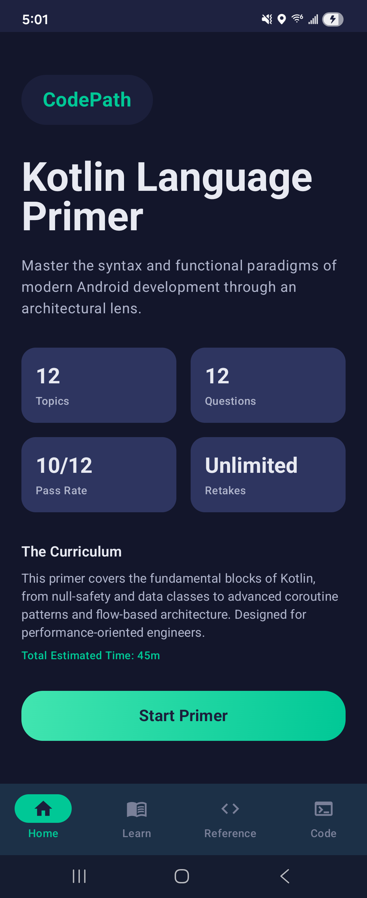
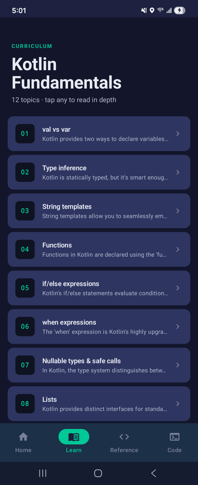
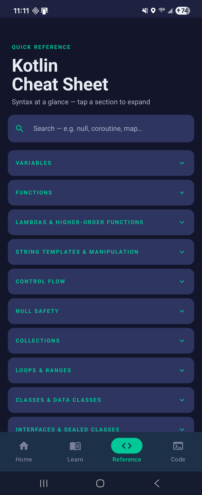
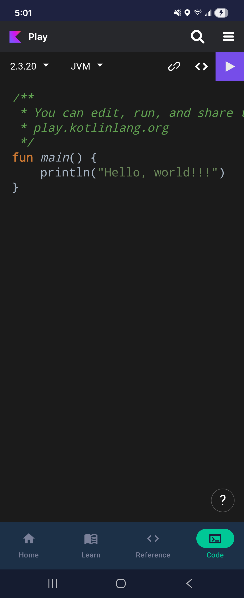

# Prework — CodePath Mobile Development

## Overview
A self-guided Android Kotlin language primer covering 12 fundamental syntax topics, each followed by a quiz question. Submitted as part of the enrollment process for CodePath's Mobile Development in the Age of AI course.

## Language
- Kotlin (Android)

## Score
<!-- Fill in your score after completing the primer -->
- Result: __ / 12

## Reflections
<!-- Any thoughts on the prework — what clicked, what was challenging, what you're curious about heading into Week 1 -->

---

## App Screens & Features

### Home — Welcome Screen
The entry point of the app. Displays a summary of the primer (12 topics, 12 questions, pass rate, and estimated time), along with a description of the curriculum. Tap **Start Primer** to begin the guided lesson flow.



---

### Learn — Kotlin Fundamentals Hub
A scrollable list of all 12 topics. Tap any topic card to open a deep-dive lesson for that topic, complete with key concepts, code examples, and an optional topic quiz — so you can study at your own pace outside the main flow.



**Topics covered:**
1. `val` vs `var`
2. Type inference
3. String templates
4. Functions
5. `if`/`else` expressions
6. `when` expressions
7. Nullable types & safe calls
8. Lists
9. `for` loops & ranges
10. `while` loops
11. Data classes
12. Classes

---

### Reference — Kotlin Cheat Sheet
A quick-reference guide with concise, copy-ready code snippets for the most common Kotlin syntax. Organized by topic and designed to be a fast lookup tool while you code.

Sections include: Variables, Functions, String Templates, Control Flow, Null Safety, Collections, Loops, and Classes & Data Classes.



---

### Code — Kotlin Playground
An embedded browser window that loads [play.kotlinlang.org](https://play.kotlinlang.org) — the official Kotlin playground. Use it to experiment with code snippets directly from the app without leaving Android Studio.



---

## Setup & Installation

Follow these steps carefully — this may be your first Android project, so each step is explained in detail.

### Prerequisites

#### 1. Install Git
Git is the tool used to download (clone) this repository to your computer.

- **Mac:** Git is typically pre-installed. Open **Terminal** and run `git --version` to verify. If prompted to install Xcode Command Line Tools, click **Install**.
- **Windows:** Download Git from [git-scm.com/download/win](https://git-scm.com/download/win) and follow the installer. During setup, the default options are fine.

Once installed, verify it works by running:
```
git --version
```

#### 2. Install Android Studio
Android Studio is the official IDE for Android development. It includes everything you need — the code editor, Android emulator, and build tools.

1. Go to [developer.android.com/studio](https://developer.android.com/studio)
2. Download the installer for your operating system (Mac or Windows)
3. Run the installer and follow the setup wizard
   - On the **Install Type** screen, choose **Standard** — this installs the Android emulator and a default SDK automatically
4. When Android Studio opens for the first time, it will finish downloading required components. Let it complete before continuing.

> **Note:** Android Studio requires several gigabytes of disk space. Make sure you have at least 8 GB free.

---

### Cloning the Repository

#### Option A: Using the Terminal (recommended)

1. Open **Terminal** (Mac) or **Git Bash** (Windows — installed with Git)
2. Navigate to the folder where you want to save the project. For example, to put it on your Desktop:
   ```
   cd ~/Desktop
   ```
3. Clone the repository by running:
   ```
   git clone https://github.com/<your-username>/<repo-name>.git
   ```
   Replace the URL with the actual repository URL (provided by your instructor or found on the GitHub page).
4. Once cloning finishes, a new folder will appear with the project files inside.

#### Option B: Using GitHub Desktop (if you prefer a visual tool)

1. Download GitHub Desktop from [desktop.github.com](https://desktop.github.com) and sign in with your GitHub account
2. Click **File → Clone Repository**
3. Paste the repository URL and choose a local folder to save it
4. Click **Clone**

---

### Opening the Project in Android Studio

1. Launch **Android Studio**
2. On the Welcome screen, click **Open** (not "New Project")
3. In the file browser, navigate to the folder where you cloned the repository
4. Select the **KotlinPrimerApp** folder and click **OK**

> **Important:** Open the `KotlinPrimerApp` folder specifically (the one that contains the `app/` subfolder and `build.gradle` files), not the outer parent folder.

---

### Waiting for Gradle to Sync

After opening the project, Android Studio will automatically start a **Gradle sync** — this downloads all the libraries and dependencies the app needs. You will see a progress bar at the bottom of the screen.

- This can take **2–5 minutes** on the first open, especially if it's your first Android project
- Do not click anything until the sync completes and the progress bar disappears
- If you see a popup asking to update the Android Gradle Plugin, click **Don't remind me again** for now

If the sync fails, check that you have a working internet connection and try **File → Sync Project with Gradle Files**.

---

### Running the App

You can run the app on either an emulator (a virtual Android phone on your computer) or a physical Android device.

#### Option A: Android Emulator (recommended for beginners)

1. In Android Studio, click **Device Manager** in the right panel (or go to **Tools → Device Manager**)
2. Click **Create Device**
3. Choose a phone model (e.g., **Pixel 6**) and click **Next**
4. Select a system image — choose one with **API Level 33 or higher** and click **Download** next to it if needed, then click **Next** and **Finish**
5. Your new emulator will appear in the device list — click the **play button (▶)** next to it to launch it
6. Once the emulator boots up (this may take a minute), go back to Android Studio
7. Make sure your emulator is selected in the device dropdown at the top of the toolbar
8. Click the green **Run button (▶)** in the toolbar — the app will build and launch on the emulator

#### Option B: Physical Android Device

1. On your Android phone, go to **Settings → About Phone** and tap **Build Number** seven times to enable Developer Mode
2. Go to **Settings → Developer Options** and turn on **USB Debugging**
3. Connect your phone to your computer with a USB cable
4. A dialog will appear on your phone asking to allow USB debugging — tap **Allow**
5. Your phone should appear in the device dropdown in Android Studio
6. Click the green **Run button (▶)** to build and install the app on your phone

---

## Submitting Your Work

Once you have completed all 12 lessons and quiz questions:

1. Note your final score from the Results screen
2. Fill in the **Score** section at the top of this README
3. Add your **Reflections** — a few sentences about what you learned or found challenging
4. Push your changes to GitHub and submit the repository link as instructed
